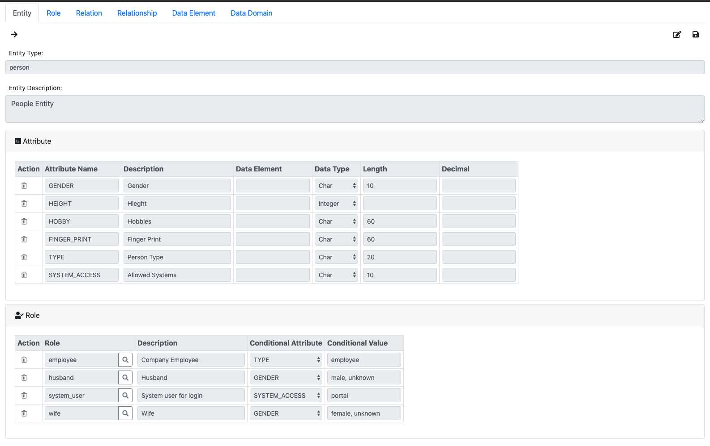
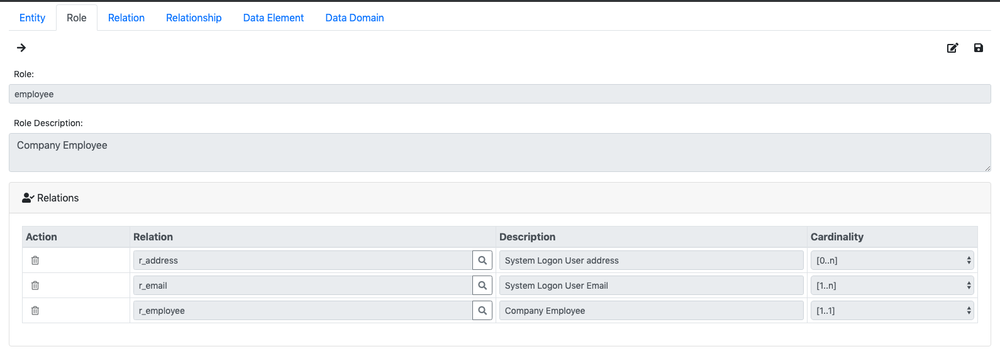
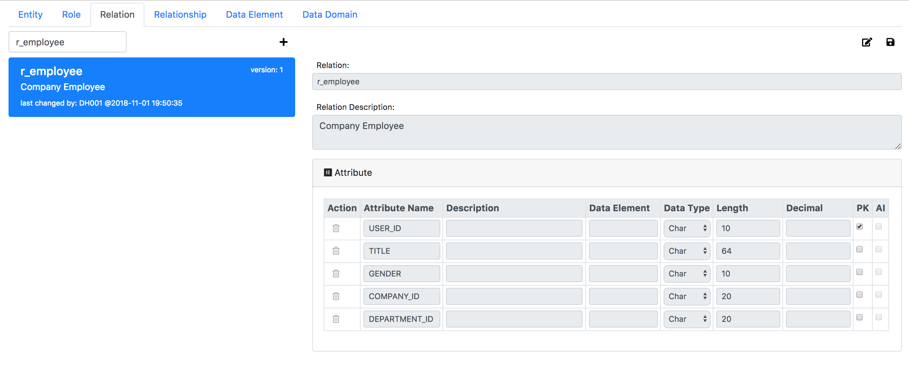
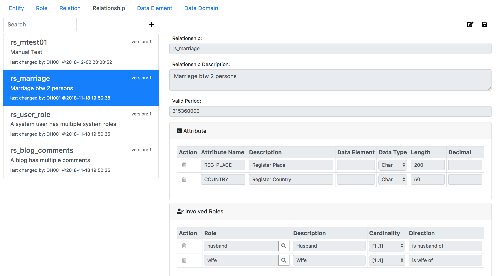
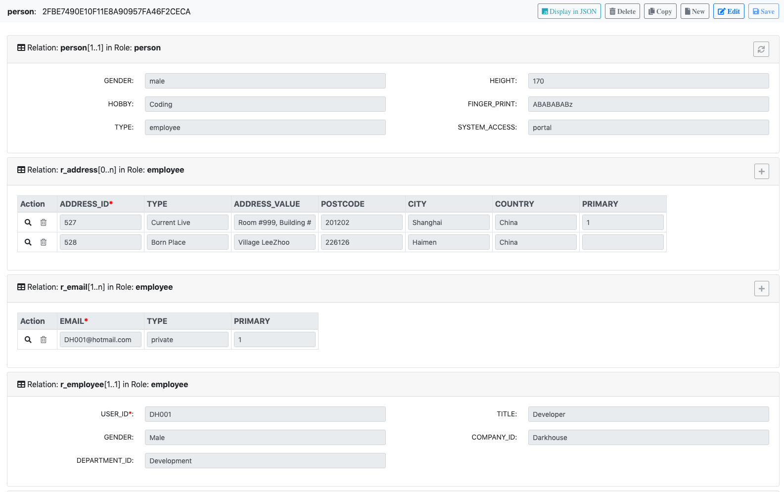
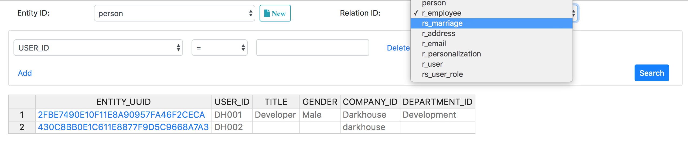
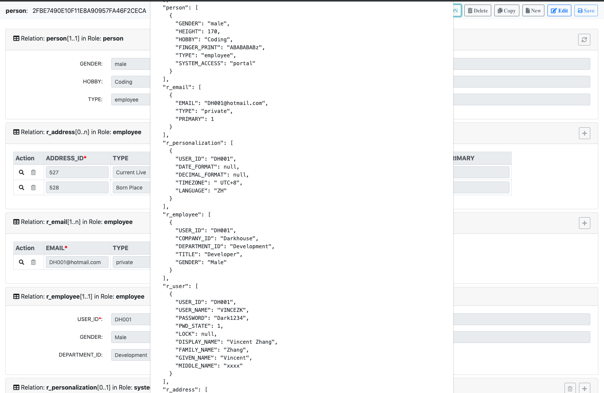

# JsonOnRelations
JSON-On-Relations converts a JSON message to SQL. 
Thus, a lot of relational data manipulations can be achieved by composing a JSON format message. 
JSON is now the de facto message format for RESTful communication. 
On the other hand, the relational database with SQL is still the only trust-able system to store and use structured data. 
Putting JSON on relations can simplify the development of enterprise applications(like ERP and CRM). 
Meanwhile, it can also help to lower the software maintenance effort by standardizing the business entity modeling.

Existing ORM solutions focus too much on the “object” concept. 
Ignoring the relational nature of data limits their capabilities on building complex enterprise applications. 
SQL is still proven to be the best abstraction of data manipulation. 
Any attempts to rebuild the wheel, or to cover another level shell, 
always end like drawing legs on a snake.

Unlike other protocols(for example: OData or JSON API), 
JSON-On-Relations is not trying to shell SQL with JSON. 
It acts more like a bridge which connects JSON with SQL DBs towards a niche area. 
The area, always mixed with other web-based applications, 
should be regarded as a separate one, which is the enterprise Line-of-Business applications.

## First Glance
### Define Your Entity
Entity "person" is defined with 4 attributes and 4 roles.  


A person can be an employee, thus it has the role "employee". Role "employee" has a relation "r_employee".


A relation corresponds to a DB table which represents a collection of attributes. 
Besides, you can also define associations among relations.


Entities can have relationships with each others. Each relationship is performed by certain roles. 
For example, relationship "marriage" is performed by 2 roles: "husband" and "wife". 
Once the 2 roles are respectively assigned to 2 people, they can then potentially have the marriage relationship.  


### Browse and Maintain Your Entity Instances
Once you have the data modelling done, you can immediately create a person instance.  


You can also search instances of an entity type based on all its relations. 


### Compose Your Message
Each entity instance can be represented as a JSON file. 
And the JSON is not just an simple format, but also a message that can be communicated with the server end. 


If you want to create a new person instance, just post the message like bellow:
```http request
POST http://localhost:3001/api/entity
Accept: */*
Cache-Control: no-cache
Content-Type: application/json

{ "ENTITY_ID": "person",
  "person": {"HEIGHT": "170", "GENDER": "male", "FINGER_PRINT": "CA67DE15727C72961EB4B6B59B76743E", "HOBBY":"Reading, Movie, Coding"},
  "r_employee": {"USER_ID": "DH001", "COMPANY_ID":"Darkhouse", "DEPARTMENT_ID": "Development", "TITLE": "Developer", "GENDER":"Male"},
  "r_address": [
     {"COUNTRY": "China", "CITY":"Shanghai", "POSTCODE": "999999",
      "ADDRESS_VALUE":"Room #999, Building #99, XXXX Road #999",
      "TYPE": "Current Live", "PRIMARY":1},
     {"COUNTRY": "China", "CITY":"Seasaw", "POSTCODE": "888888",
      "ADDRESS_VALUE" : "West Valley Lake",
      "TYPE": "Born Place", "PRIMARY":0}],
  "relationships":[ ]
}
```  

If you want to change the TITLE of an employee(person) from "Developer" to "Architect", then:
```http request
PUT http://localhost:3001/api/entity
Accept: */*
Cache-Control: no-cache
Content-Type: application/json

{ "ENTITY_ID": "person",
  "INSTANCE_GUID": "2FBE7490E10F11E8A90957FA46F2CECA",
  "r_employee": {"action": "update", "USER_ID": "DH001", "TITLE": "Architect"},
}
```  

Want to add a new address? just do it in this way:
```http request
PUT http://localhost:3001/api/entity
Accept: */*
Cache-Control: no-cache
Content-Type: application/json

{ "ENTITY_ID": "person",
  "INSTANCE_GUID": "2FBE7490E10F11E8A90957FA46F2CECA",
  "r_address": [
     {"action": "add", "COUNTRY": "China", "CITY":"Shanghai", "POSTCODE": "777777",
      "ADDRESS_VALUE":"Building #909, YYYY Road #101",
      "TYPE": "Office", "PRIMARY":0}
      ]
}
```  

## How to Use
**You can either directly explore on the hosted websites:**
 + [Modeling](https://darkhouse.com.cn/jor/model)
 + [Entity Browser](https://darkhouse.com.cn/jor/entity/list)
 
**Or by applying following steps to establish in your own environment**
    
1. Install it to your node/angular project:
   ```bash
    $ npm install json-on-relations --save
   ```
2. Create the database in MySQL: 

   Copy file "node_modules/json-on-relations/MDB.sql" to your sql console and execute. 
   The script will create database "MDB" which contains all the tables and test data.
   
   Please also create a DB user 'nodejs' with password 'nodejs'. 
   By default, Portal uses credential 'nodejs/nodejs' to connect MySql at port 3306. 
   You can of course change the default settings. Please refer the next step.
   
3. In your NodeJS project:
   Copy the folder "node_modules/json-on-relations/dist" and its belongings to your project root. 
 
   create "server.js" in the project root with following:
   ```javascript 1.8
   const express = require('express');
   const app = express();

   // We don't want to serve sessions for static resources
   const path = require('path');
   app.use(express.static(path.join(__dirname, 'dist/jor')));

   const cors = require('cors'); // Allow cross site requests
   app.use(cors());

   app.use(require('body-parser').json());
   const compress = require('compression');
   app.use(compress());
   
   // Routing
   const routes = require('json-on-relations').Routes;
   app.use('/', routes);
   // The index page as an entry point
   app.route('*').get( (req, res) => {   
     res.sendFile(path.join(__dirname, '../dist/jor/index.html'));
   });
   
   process.on('SIGINT',function(){
     console.log("Closing.....");
     process.exit()
   });
   
   const entityDB = require('json-on-relations').EntityDB;
   entityDB.setConnPool('mysql', { // Set the connection pool to your mysql DB.
                                   // Currently, we only support mysql.
                                   connectionLimit : 10,
                                   host: 'localhost',  // To be replaced by your DB host
                                   user: 'nodejs',     // To be replaced by your own DB user
                                   password: 'nodejs', // To be replaced by your own DB password
                                   database: 'MDB',
                                   createDatabaseTable: true,
                                   multipleStatements: true,
                                   dateStrings: true,
                                   port: 3306           // replaced by your DB port.
                                 });
   entityDB.executeSQL("select ENTITY_ID from ENTITY", function (err, rows) {
     if(err) debug("bootstrap: get entities==> %s", err);
     else {
       const entities = [];
       rows.forEach( row => entities.push(row.ENTITY_ID));
       entityDB.loadEntities(entities, function (err) {
         if(err) debug("bootstrap: load entities==> %s", err);
         else app.listen(3001, () => console.log('Example app listening on port 3001!'));
       })
     }
   });
   ```
   You should also install following involved packages: express, path, cors, body-parse, and compression.
4. Start the server:
   ```bash
    $ node server.js
   ```
5. Open the links:
   + [Modeling](http://localhost:3001/model)
   + [Entity Browser](http://localhost:3001/entity/list)
   
*If you are using Angular for UI development, you can install the package 'npm i jor-angular' for the types.*  
   
## RESTful API
Following APIs are opened in the default route table. These examples are also listed in the 'test/test_api.http'. 
### Create a person instance
```http request
POST http://localhost:3001/api/entity
Accept: */*
Cache-Control: no-cache
Content-Type: application/json

{ "ENTITY_ID": "person",
  "person": {"HEIGHT": "180", "GENDER": "male", "HOBBY":"Reading, Movie, Coding"},
  "r_user": {"USER_ID": "DH999", "USER_NAME":"John", "DISPLAY_NAME": "John Wu"},
  "r_email": [{"EMAIL": "dh999@hotmail.com", "TYPE": "private", "PRIMARY":1}],
  "r_employee": {"USER_ID": "DH999", "COMPANY_ID":"Darkhouse", "DEPARTMENT_ID":"Development","TITLE":"Developer"},
  "relationships":[
    { "RELATIONSHIP_ID": "rs_user_role",
      "values":[
        { "SYNCED":0,
          "PARTNER_INSTANCES":[
            {"ENTITY_ID":"system_role", "ROLE_ID":"system_role", "INSTANCE_GUID":"5F50DE92743683E1ED7F964E5B9F6167"}]}
      ]
    }]
}
```    
### Change a person instance
The reserved field "action" is introduced for each relation. Its value could be "update", "add", and "delete".

The example will do the following changes:
1) Update the HEIGHT and HOBBY of "person" relation;
2) Update the USER_NAME of "r_user" relation;
3) Add a new email address;
4) Add a new relationship to "system_role".

```http request
PUT http://localhost:3001/api/entity
Accept: */*
Cache-Control: no-cache
Content-Type: application/json

{ "ENTITY_ID": "person",
  "INSTANCE_GUID": "2FBE7490E10F11E8A90957FA46F2CECA",
  "person": {"action": "update", "HEIGHT": 180, "HOBBY":"Reading, Movie"},
  "r_user": {"action": "update", "USER_ID": "DH999", "USER_NAME":"JohnWu"},
  "r_email": [{"action": "add", "EMAIL": "dh999@darkhouse.com", "TYPE": "work", "PRIMARY":0}],
  "relationships":[
    {
      "RELATIONSHIP_ID": "rs_user_role",
      "values": [
        {
          "action": "add",
          "VALID_FROM": "2020-12-31 00:00:00",
          "VALID_TO": "2030-12-31 00:00:00",
          "SYNCED": 1,
          "PARTNER_INSTANCES": [
            {
              "ENTITY_ID": "system_role",
              "ROLE_ID": "system_role",
              "INSTANCE_GUID": "F914BC7E2BD65D42A0B17FBEAD8E1AF2"
            }
          ]
        }
      ]
    }]
}
```
### Overwrite a person instance
The API overwrites an instance as a whole with a given JSON object. 
Those appeared relations are updated with new values. 
Those not appeared will be deleted.
This API is useful in some UI technologies which always regards an entity as a whole.
Then you don't have to trace every changed pieces, just post it as an atomic object to the backend store.

Besides it may introduce some performance overhead, 
another limitation is that relationships are not supported with "overwrite" mode. 
This is because a relationship always deals with more than 2 entities,
 thus cannot be overwritten from one single side.
```http request
PUT http://localhost:3001/api/entity/overwrite
Accept: */*
Cache-Control: no-cache
Content-Type: application/json

{ "ENTITY_ID": "person",
  "INSTANCE_GUID": "2FBE7490E10F11E8A90957FA46F2CECA", 
  "person": {"HEIGHT": "180", "GENDER": "male", "HOBBY":"Reading, Movie, Coding, Singing"},
  "r_user": {"USER_ID": "DH999", "USER_NAME":"JohnWu", "DISPLAY_NAME": "John Wu"},
  "r_email": [{"EMAIL": "dh999@hotmail.com", "TYPE": "private", "PRIMARY":1}],
  "r_employee": {"USER_ID": "DH999", "COMPANY_ID":"Darkhouse", "DEPARTMENT_ID":"Development","TITLE":"Developer"}
}
```
### Get an entity instance through its UUID
The return is an entity instance in JSON format. The relationships are also included
```http request
GET http://localhost:3001/api/entity/instance/2FBE7490E10F11E8A90957FA46F2CECA
Accept: */*
Cache-Control: no-cache
```
### Get pieces of an entity instance through its UUID
Use this API to decide which relations or relationships you need from an entity instance.
The given example requests 2 relations: "r_user" and "r_email" from a person entity, 
together with one relationship "rs_user_role". 
The return is a projection of the entity instance.

The API can save performance if you only need some pieces of the information from a big entity.
```http request
POST http://localhost:3001/api/entity/instance/piece/2FBE7490E10F11E8A90957FA46F2CECA
Accept: */*
Cache-Control: no-cache
Content-Type: application/json

{
  "RELATIONS": ["r_user", "r_email"],
  "RELATIONSHIPS": ["rs_user_role"]
 }
```
### Get an entity instance through one of its business ID
The business ID always belongs to one of an entity's relations. 
For example, the attribute USER_ID is one of the person entity's business IDs,
which belongs to the relation "r_employee".
You need to make sure the business ID can uniquely identify the entity, 
or it will give you the first hit that matches this ID.

The return is a complete entity instance in JSON format.
```http request
POST http://localhost:3001/api/entity/instance
Accept: */*
Cache-Control: no-cache
Content-Type: application/json

{
  "RELATION_ID": "r_employee",
  "USER_ID": "DH001"
}
```

### Get pieces of an entity instance through its business ID
Use this API to get pieces of an entity from its business ID.
In following example, it gets relations "r_user" and "r_email", and the relationship "rs_user_role"
for the user "DH001".
```http request
POST http://localhost:3000/api/entity/instance/piece
Accept: */*
Cache-Control: no-cache
Content-Type: application/json

{
  "ID": {
    "RELATION_ID": "r_user",
    "USER_ID": "DH001"
  },
  "piece": {
    "RELATIONS": ["r_user", "r_email"],
    "RELATIONSHIPS": ["rs_user_role"]
  }
}
```

### Get partner information from the relationship
When you make a request to retrieve the information of an entity, you also want some of its partners' information.
You don't need to make 2 or more requests, just request the partners' information in the relationships.

Like bellow request, it will return the role and marriage partner information together with the person's own information. 
You can recursively request all the entities that have relationship networks with each other.  
```http request
POST http://localhost:3000/api/entity/instance/piece
Accept: */*
Cache-Control: no-cache
Content-Type: application/json

{
  "ID": {
    "RELATION_ID": "r_user",
    "USER_ID": "DH001"
  },
  "piece": {
    "RELATIONS": ["r_user", "r_personalization"],
    "RELATIONSHIPS": [
      {"RELATIONSHIP_ID": "rs_user_role",
       "PARTNER_ENTITY_PIECES": [
        {"ENTITY_ID": "permission",
         "piece": {"RELATIONS": ["r_role"], "RELATIONSHIPS": ["rs_user_role"]}}]},
      {"RELATIONSHIP_ID": "rs_marriage",
       "PARTNER_ENTITY_PIECES": [
         {"ENTITY_ID": "person",
           "piece": {"RELATIONS": ["person"]}}]}
    ]
  }
}
```

### Generic Query Request
A query is defined as a JSON object with 2 mandatory attributes: "ENTITY_ID" and "RELATION_ID".
You must tell the system on which entity and which leading relation the query is made on. 

"PROJECTION" is an array in which you can include fields not only from the leading relation,
but also from all the associated relations. The system helps you to do the sql-joins.
If "PROJECTION" is not given, then it means all the fields from the leading relation. 

The filter is limited with operators: EQ(Equal), NE(Not Equal), GT(Greater Than), GE(Greater than and Equal), 
LT(Less Than), LE(Less Than and Equal), and BT(Between). 
You can also use fields from the assoicated relations to do the filtering and sorting.

You can also define sort criteria. On which which fields you want to sort the result sets, 
ascending(asc) or descending(desc). The return is a list of entries that fulfills the query.
```http request
POST http://localhost:3001/api/query
Accept: */*
Cache-Control: no-cache
Content-Type: application/json

{
  "ENTITY_ID": "person",
  "RELATION_ID": "r_user",
  "PROJECTION": [
    "USER_ID",
    "USER_NAME",
    "GIVEN_NAME",
    {"FIELD_NAME": "COMPANY_ID", "ALIAS": "Company", "RELATION_ID": "r_employee"}
  ],
  "FILTER": [
    {
      "FIELD_NAME": "USER_ID",
      "OPERATOR": "BT",
      "LOW": "DH001",
      "HIGH": "DH999
    },
    {
      "FIELD_NAME": "LANGUAGE",
      "OPERATOR": "EQ",
      "RELATION_ID": "r_personalization",
      "LOW": "ZH"
    }
  ],
  "SORT": [
    {
      "FIELD_NAME": "LANGUAGE",
      "RELATION_ID": "r_personalization",
      "ORDER": "desc"
    }
  ]
}
```

## User AddIn & Function
Providing CRUD to an entity instance is far more enough. 
We need more on business level validation, substitution, and enrichment.
For example, we need run a permission check before the user is allowed to change an instance.
Or we need enrich some information which can be auto derived, like changed-by, changed time, and so on.
Another more specific example in financial area, is to auto generate tax line items when posting an invoice.

With such very domain specific logic, a framework can hardly do everything for you.
However, a good framework can help you focus on writing your domain specific logic. 
That is to say, you don't need to care about or worry about how the data is persisted, 
how the incoming requests are routed, how the security is ensured, and so on.

JSON-ON-Relations, of course, can not address all of those generic and basis services. 
However, it fills a gap between API/UI and relational schema.
The gap, in fact, is never well filled. 
Existing ORM solutions just connect a relational schema to an object schema.
There is still a long way to the API/UI consumption. 
And it only considers the development efficiency. Less consideration is given for the maintenance efficiency.
While here "maintenance", I mean model changes, business process adjustments, and UI changes during the software lifecycle.

Other solutions, like Ruby-on-Rails, provide very efficient development model 
by generating DB tables, API, and UI based on a relational schema. 
But they can only help if you are building a "toy" for fun.
Too much limitations are found in using a relation-to-UI approach.
And I have never seen a real success one.

### Default User AddIns
User AddIn allows you to enhance existing business logic.
However, you can only add your logic in predefined calling points.

In the following example, the function 'getEntityInstance' is registered to the User AddIn 'afterEntityCreation'.
Then, after an entity instance is created, it will be read from the DB and returned to the UI.
```javascript 1.8
afterEntityCreation.use('*', getEntityInstance);

function getEntityInstance(req, callback) {
  entity.getInstanceByGUID(req.body['INSTANCE_GUID'], function (err, instance){
    if(err) callback(err); 
    else {
      req.body = instance; // Pass the instance to the next addIn function
      callback(null, instance);
    }
  })
}
```
A User AddIn function has 2 parameters: the first one is the http request object passed by ExpressJS, 
and the second one is a callback function. You can register an AddIn function under a topic.
Thus, only the requests that belong to the topic will invoke the AddIn function.
If you register it under the topic '*', then all the requests will invoke the function.

By default, following User AddIns are defined by Json-on-Relations:
1. beforeEntityCreation: Use this AddIn to add logic before creating an entity instance.
2. beforeEntityChanging: Use this AddIn to add logic before changing an entity instance.
3. beforeEntityQuery: Use this AddIn to add logic before query entity instances.
4. beforeMetaReading: Use this AddIn to add logic before reading entity meta data.
5. beforeModelProcessing: Use this AddIn add logic before processing models.
6. afterEntityCreation: Use this AddIn to add logic after an entity instance is created.
7. afterEntityChanging: Use this AddIn to add logic after an entity instance is changed.
8. afterEntityReading: Use this AddIn to add logic after an entity instance is read.

### Register User Functions
With User Function, you can implement arbitrary business logic. 

A User Function has 3 parameters, with the first one 'input' pointing to the *req.body* passed by ExpressJS.
The second parameter is 'user' which points the user session context passed by PassportJS.
The third one is a callback function for the returned value which will be read by the client.
 
If you register a User Function as following:
```javascript 1.8
const userFunction = require('./server/models/userFunction');

userFunction.register('testFunction', function (input, user, callback) {
  callback(null, 'The input is read from req.body: ' + input, 'and the user context is ' + user );
});
```
Then, this function can be RESTfully called:
```http request
POST http://localhost:3000/api/function/testFunction
Accept: */*
Cache-Control: no-cache
Content-Type: application/json

"Hello World!"
```

## Concept Behind
An entity is a "thing" which can be distinctly identified. A specific person, company, or event is an example of an entity. 
A relationship is an association among entities. For instance, "marriage" is a relationship between two "person" entities.

Details are illustrated in the following diagram:


An Entity can have multiple direct attributes, 
as well as indirect attributes from the roles that are assigned to it. 
Roles don't have attributes directly, but are inherit from the relations assigned to them.

A relation corresponds to a DB table, and its attributes are fields of the table.
Relations can have associations with each other. 
For example, relation "r_employee" has a 1-on-1 association to relation "r_company" based on the field "COMPANY_ID".
Even 2 relations separately belong to 2 different entities can be associated.

Roles perform relationships. Once a role is assigned to an entity, 
its relationships thus can be applied to the entity. 
And the relationship instances are actually the associations among entities.

Both Entity and Relationship can be regarded as 2 special kinds of relation.

To achieve re-usability and context consistency, the meta of an attribute can be defined as data elements and data domains.
data domain is used to boundary the value type and range of an attribute. 
For example, data domain "Country" contains all the country codes in the world so far.
while a data element can be assigned with a data domain, and adding more business semantics like labels, documentations, and so on. 

## Planned Features
+ Data Domain and Data Element. 
+ Entity orchestration: combined operations on multiple entities together.
+ Version management of data modeling.
+ Introduce DB view concept and a report painter tool.

## License
[The MIT License](http://opensource.org/licenses/MIT)

