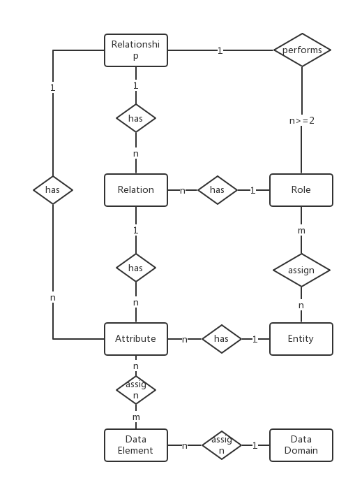

# JsonOnRelations
Json-on-relations try to bundle the merits from both JSON and relational structures.
Nowadays, JSON is the de-facto standard for data transmitting and UI consumption.
Comparing to other data format standards like XML, it is much simpler and more human readable. 

Relational database is still strong enough, just no one can replace it. 
Existing ORM solutions focus too much on "object".
Ignoring the relational nature of data limits their abilities on building real-world applications.
SQL is still proven to be the only meaningful abstraction of data manipulation. 
Any attempts to rebuild the wheel always end with ignorant.
Ideas like OData and JSON API will just yield to SQL as it always be. 

*In Construction...*

## License
[The MIT License](http://opensource.org/licenses/MIT)
