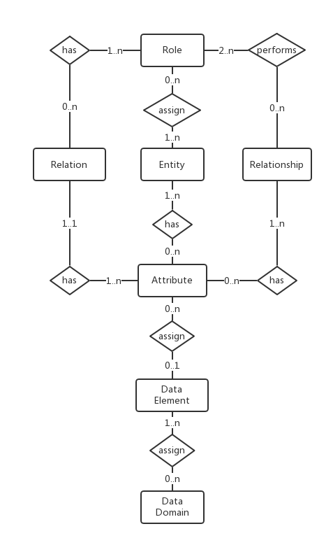

# JsonOnRelations
JSON-On-Relations converts a JSON message to SQL. Thus, a lot of relational data manipulations can be achieved by composing a JSON format message. JSON is now the de facto message format for RESTful communication. On the other hand, the relational database with SQL is still the only trust-able system to store and use structured data. Putting JSON on relations can simplify the development of enterprise level applications(like ERP and CRM). Meanwhile, it can also help to lower the software maintenance effort by standardizing the business entity modeling.

Existing ORM solutions focus too much on the “object” concept. Ignoring the relational nature of data limits their capabilities on building complex enterprise applications. SQL is still proven to be the best abstraction of data manipulation. Any attempts to rebuild the wheel, or to cover another level shell, always end like drawing legs on a snake.

Unlike other protocols(for example: OData or JSON API), JSON-On-Relations is not trying to shell SQL with JSON. It acts more like a bridge which connects JSON with SQL DBs towards a niche area. The area, always mixed with other web-based applications, should be regarded as a separate one, which is the enterprise Line-of-Business applications.

## First Glance
### Define Your Entity
Entity "person" is defined with 4 attributes and 4 roles.  


A person can be an employee, thus it has the role "employee". Role "employee" has a relation "r_employee".


A relation corresponds to a DB table which represents a collection of attributes. 
Besides, you can also define associations among relations.


Entities can have relationships with each others. Each relationship is performed by certain roles. 
For example, relationship "marriage" is performed by 2 roles: "husband" and "wife". 
Once the 2 roles are respectively assigned to 2 people, they can then potentially have the marriage relationship.  


### Browse and Maintain Your Entity Instances
Once you have the data modelling done, you can immediately create a person instance.  


You can also search instances of different entity types based on all their available attributes from relations and relationships. 


### Compose Your Message
Each entity instance can be represented as a JSON file. 
And the JSON is not just an simple format, but also a message that can be communicated with the server end. 


If you want to create a new person instance, just post the message like bellow:
```http request
POST http://localhost:3001/api/entity
Accept: */*
Cache-Control: no-cache
Content-Type: application/json

{ "ENTITY_ID": "person",
  "person": {"HEIGHT": "170", "GENDER": "male", "FINGER_PRINT": "CA67DE15727C72961EB4B6B59B76743E", "HOBBY":"Reading, Movie, Coding"},
  "r_employee": {"USER_ID": "DH001", "COMPANY_ID":"Darkhouse", "DEPARTMENT_ID": "Development", "TITLE": "Developer", "GENDER":"Male"},
  "r_address": [
     {"COUNTRY": "China", "CITY":"Shanghai", "POSTCODE": "999999",
      "ADDRESS_VALUE":"Room #999, Building #99, XXXX Road #999",
      "TYPE": "Current Live", "PRIMARY":1},
     {"COUNTRY": "China", "CITY":"Seasaw", "POSTCODE": "888888",
      "ADDRESS_VALUE" : "West Valley Lake",
      "TYPE": "Born Place", "PRIMARY":0}],
  "relationships":[ ]
}
```  

If you want to change the TITLE of an employee(person) from "Developer" to "Architect", then:
```http request
PUT http://localhost:3001/api/entity
Accept: */*
Cache-Control: no-cache
Content-Type: application/json

{ "ENTITY_ID": "person",
  "INSTANCE_GUID": "2FBE7490E10F11E8A90957FA46F2CECA",
  "r_employee": {"action": "update", "USER_ID": "DH001", "TITLE": "Architect"},
}
```  

Want to add a new address? just do it in this way:
```http request
PUT http://localhost:3001/api/entity
Accept: */*
Cache-Control: no-cache
Content-Type: application/json

{ "ENTITY_ID": "person",
  "INSTANCE_GUID": "2FBE7490E10F11E8A90957FA46F2CECA",
  "r_address": [
     {"action": "add", "COUNTRY": "China", "CITY":"Shanghai", "POSTCODE": "777777",
      "ADDRESS_VALUE":"Building #909, YYYY Road #101",
      "TYPE": "Office", "PRIMARY":0}
      ]
}
```  

## How to Use
**You can either directly explore on the hosted websites:**
 + [Modeling](https://darkhouse.com.cn/jor/model)
 + [Entity Browser](https://darkhouse.com.cn/jor/entity/list)
 
**Or by applying following steps to establish in your own environment**
    
1. Install it to your node/angular project:
   ```bash
    $ npm install json-on-relations --save
   ```
2. Create the database in MySQL: 
   ```
   Copy the "node_modules/json-on-relations/db.sql" to your sql console and execute.
   The script will create database named "MDB" which contains all the tables. 
   ```
3. In Node:
   ``` 
   copy "node_modules/json-on-relations/dist" to your project root. 
   ```
   create "server.js" in the project root with following:
   ```javascript 1.8
   const express = require('express');
   const app = express();

   // We don't want to serve sessions for static resources
   const path = require('path');
   app.use(express.static(path.join(__dirname, 'dist/jor')));

   const cors = require('cors'); // Allow cross site requests
   app.use(cors());

   app.use(require('body-parser').json());
   const compress = require('compression');
   app.use(compress());
   
   // Routing
   const routes = require('json-on-relations').Routes;
   app.use('/', routes);
   
   process.on('SIGINT',function(){
     console.log("Closing.....");
     process.exit()
   });
   
   const entityDB = require('json-on-relations').EntityDB;
   entityDB.executeSQL("select ENTITY_ID from ENTITY", function (err, rows) {
     if(err) debug("bootstrap: get entities==> %s", err);
     else {
       const entities = [];
       rows.forEach( row => entities.push(row.ENTITY_ID));
       entityDB.loadEntities(entities, function (err) {
         if(err) debug("bootstrap: load entities==> %s", err);
         else app.listen(3001, () => console.log('Example app listening on port 3001!'));
       })
     }
   });
   ```
   You should also install following packages: express, path, cors, body-parse, and compression.
4. Start the server:
   ```bash
    $ node server.js
   ```
5. Open the links:
   + [Modeling](http://localhost:3001/model)
   + [Entity Browser](http://localhost:3001/entity/list)
   
## Restful API
Following APIs are opened in the default route table.
### Create a person instance
```http request
POST http://localhost:3001/api/entity
Accept: */*
Cache-Control: no-cache
Content-Type: application/json

{ "ENTITY_ID": "person",
  "person": {"HEIGHT": "180", "GENDER": "male", "HOBBY":"Reading, Movie, Coding"},
  "r_user": {"USER_ID": "DH999", "USER_NAME":"John", "DISPLAY_NAME": "John Wu"},
  "r_email": [{"EMAIL": "dh999@hotmail.com", "TYPE": "private", "PRIMARY":1}],
  "r_employee": {"USER_ID": "DH999", "COMPANY_ID":"Darkhouse", "DEPARTMENT_ID":"Development","TITLE":"Developer"},
  "relationships":[
    { "RELATIONSHIP_ID": "rs_user_role",
      "values":[
        { "SYNCED":0,
          "PARTNER_INSTANCES":[
            {"ENTITY_ID":"system_role", "ROLE_ID":"system_role", "INSTANCE_GUID":"5F50DE92743683E1ED7F964E5B9F6167"}]}
      ]
    }]
}
```    
### Change a person instance
The reserved field "action" is introduced for each relation. Its value could be "update", "add", and "delete".

The example will do the following changes:
1) Update the HEIGHT and HOBBY of "person" relation;
2) Update the USER_NAME of "r_user" relation;
3) Add a new email address;
4) Add a new relationship to "system_role".

```http request
PUT http://localhost:3001/api/entity
Accept: */*
Cache-Control: no-cache
Content-Type: application/json

{ "ENTITY_ID": "person",
  "INSTANCE_GUID": "2FBE7490E10F11E8A90957FA46F2CECA",
  "person": {"action": "update", "HEIGHT": 180, "HOBBY":"Reading, Movie"},
  "r_user": {"action": "update", "USER_ID": "DH999", "USER_NAME":"JohnWu"},
  "r_email": [{"action": "add", "EMAIL": "dh999@darkhouse.com", "TYPE": "work", "PRIMARY":0}],
  "relationships":[
    {
      "RELATIONSHIP_ID": "rs_user_role",
      "values": [
        {
          "action": "add",
          "VALID_FROM": "2020-12-31 00:00:00",
          "VALID_TO": "2030-12-31 00:00:00",
          "SYNCED": 1,
          "PARTNER_INSTANCES": [
            {
              "ENTITY_ID": "system_role",
              "ROLE_ID": "system_role",
              "INSTANCE_GUID": "F914BC7E2BD65D42A0B17FBEAD8E1AF2"
            }
          ]
        }
      ]
    }]
}
```
### Overwrite a person instance
The API overwrites an instance as a whole with a given JSON object. 
Those appeared relations are updated with new values. 
Those not appeared will be deleted.
This API is useful in some UI technologies which always regards an entity as a whole.
Then you don't have to trace every changed pieces, just post it as an atomic object to the backend store.

Besides it may introduce some performance overhead, 
another limitation is that relationships are not supported with "overwrite" mode. 
This is because a relationship always deals with more than 2 entities,
 thus cannot be overwritten from one single side.
```http request
PUT http://localhost:3001/api/entity/overwrite
Accept: */*
Cache-Control: no-cache
Content-Type: application/json

{ "ENTITY_ID": "person",
  "INSTANCE_GUID": "2FBE7490E10F11E8A90957FA46F2CECA", 
  "person": {"HEIGHT": "180", "GENDER": "male", "HOBBY":"Reading, Movie, Coding, Singing"},
  "r_user": {"USER_ID": "DH999", "USER_NAME":"JohnWu", "DISPLAY_NAME": "John Wu"},
  "r_email": [{"EMAIL": "dh999@hotmail.com", "TYPE": "private", "PRIMARY":1}],
  "r_employee": {"USER_ID": "DH999", "COMPANY_ID":"Darkhouse", "DEPARTMENT_ID":"Development","TITLE":"Developer"}
}
```
### Get an entity instance through its UUID
The return is an entity instance in JSON format. The relationships are also included
```http request
GET http://localhost:3001/api/entity/instance/2FBE7490E10F11E8A90957FA46F2CECA
Accept: */*
Cache-Control: no-cache
```
### Get pieces of an entity instance through its UUID
Use this API to decide which relations or relationships you need from an entity instance.
The given example requests 2 relations: "r_user" and "r_email" from a person entity, 
together with one relationship "rs_user_role". 
The return is a projection of the entity instance.

The API can save performance if you only need some pieces of the information from a big entity.
```http request
POST http://localhost:3001/api/entity/instance/piece/2FBE7490E10F11E8A90957FA46F2CECA
Accept: */*
Cache-Control: no-cache
Content-Type: application/json

{
  "RELATIONS": ["r_user", "r_email"],
  "RELATIONSHIPS": ["rs_user_role"]
 }
```
### Get an entity instance through one of its business ID
The business ID always belongs to one of an entity's relations. 
For example, the attribute USER_ID is one of the person entity's business IDs,
which belongs to the relation "r_employee".
You need to make sure the business ID can uniquely identify the entity, 
or it will give you the first hit that matches this ID.

The return is a complete entity instance in JSON format.
```http request
POST http://localhost:3001/api/entity/instance
Accept: */*
Cache-Control: no-cache
Content-Type: application/json

{
  "RELATION_ID": "r_employee",
  "USER_ID": "DH001"
}
```
### Generic Query Request
A query is defined as a JSON object with 3 attributes: "relation", "projection", and "filter".
The "relation" defines the leading relation(table). You can project fields not only from one leading relation,
but also from all its associated relations. The system helps you to do the sql-joins.

The filter is limited with operators: EQ(Equal), NE(Not Equal), GT(Greater Than), GE(Greater than and Equal), 
LT(Less Than), LE(Less Than and Equal), and BT(Between). 
You can also use fields from the assoicated relations to do the filtering and sorting.

The return is a list of entries that fulfills the query.
```http request
POST http://localhost:3001/api/query
Accept: */*
Cache-Control: no-cache
Content-Type: application/json

{
  "relation": "r_user",
  "projection": [
    "USER_ID",
    "USER_NAME",
    "GIVEN_NAME",
    {"fieldName": "COMPANY_ID", "alias": "Company", "relation": "r_employee"}
  ],
  "filter": [
    {
      "fieldName": "USER_ID",
      "operator": "BT",
      "low": "DH001",
      "high": "DH999"
    },
    {
      "fieldName": "LANGUAGE",
      "operator": "EQ",
      "relation": "r_personalization",
      "low": "ZH"
    }
  ],
  "sort": [
    {
      "fieldName": "LANGUAGE",
      "relation": "r_personalization",
      "order": "desc"
    }
  ]
}
```
## Concept Behind
An entity is a "thing" which can be distinctly identified. A specific person, company, or event is an example of an entity. 
A relationship is an association among entities. For instance, "marriage" is a relationship between two "person" entities.

Details are illustrated in the following diagram:



An Entity can have multiple direct attributes, 
as well as indirect attributes from the roles that are assigned to it. 
Roles don't have attributes directly, but are inherit from the relations assigned to them.

A relation corresponds to a DB table, and its attributes are fields of the table.
Relations can have associations with each other. 
For example, relation "r_employee" has a 1-on-1 association to relation "r_company" based on the field "COMPANY_ID".
Even 2 relations separately belong to 2 different entities can be associated.

Roles perform relationships. Once a role is assigned to an entity, 
its relationships thus can be applied to the entity. 
And the relationship instances are actually the associations among entities.

Both Entity and Relationship can be regarded as 2 special kinds of relation.

To achieve re-usability and context consistency, the meta of an attribute can be defined as data elements and data domains.
data domain is used to boundary the value type and range of an attribute. 
For example, data domain "Country" contains all the country codes in the world so far.
while a data element can be assigned with a data domain, and adding more business semantics like labels, documentations, and so on. 

## Planned Features
+ Data Domain and Data Element. 
+ Plug-able validation, substitution, and enrichment during message processing.
+ Entity orchestration: combined operations on multiple entities together.
+ Version management of data modeling.
+ Introduce DB view concept and a report painter tool.
+ Integrate into [Portal](https://github.com/VinceZK/Portal) to support user login and session.

## License
[The MIT License](http://opensource.org/licenses/MIT)

