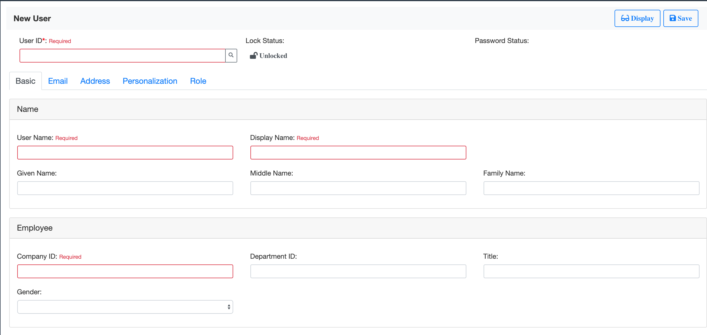

# JsonOnRelations Angular Library
This package has the Angular libraries for [JsonOnRelations](https://github.com/VinceZK/json-on-relations).
With these libraries, one can easily compose CRUD Apps. 

So far, it contains:
1. **Attribute UI Controls**: Angular UI components that can be directly used to compose an object page; 
2. **Search Help**: A button close to an input field which pops up a dialog to allow user to search possible values and input it to the field;
3. **UI Mapper**: Utility methods used to convert Angular AbstractControl to JOR JSON format;
4. **Entity Services**: Generic services allow manipulations on entity instances and metas;
5. **Reusable Types**: Reusable data types in JOR;

Please check this [example](https://darkhouse.com.cn/portal/external-app/USER) which is developed using JOR-Angular.
Its source code can be found in this [GIT Repo](https://github.com/VinceZK/Logon/tree/master/src/app/user)


## Attribute UI Controls
Following UI is composed using the attribute UI control **dk-app-attribute-form2**. 


```html
<div class="card mt-4">
  <div class="card-header">Employee</div>
  <div class="card-body">
    <form class="mt-2 row">
      <dk-app-attribute-form2 class="col-md-6 col-lg-4 dk-form-label"
                              [attributeControl]="getAttrCtrlFromID('COMPANY_ID')"
                              [formGroup]="userBasicEmployeeForm"
                              [readonly]="readonly">
      </dk-app-attribute-form2>
      <dk-app-attribute-form2 class="col-md-6 col-lg-4 dk-form-label"
                              [attributeControl]="getAttrCtrlFromID('DEPARTMENT_ID')"
                              [formGroup]="userBasicEmployeeForm"
                              [readonly]="readonly">
      </dk-app-attribute-form2>
      <dk-app-attribute-form2 class="col-md-6 col-lg-4 dk-form-label"
                              [attributeControl]="getAttrCtrlFromID('TITLE')"
                              [formGroup]="userBasicEmployeeForm"
                              [readonly]="readonly">
      </dk-app-attribute-form2>
      <dk-app-attribute-form2 class="col-md-6 col-lg-4 dk-form-label"
                              [attributeControl]="getAttrCtrlFromID('GENDER')"
                              [formGroup]="userBasicEmployeeForm"
                              [readonly]="readonly">
      </dk-app-attribute-form2>
    </form>
  </div>
</div>
```
The main benefit is that labels, value options, and validations are derived from the attribute's meta definition. 
For example, the attribute "Gender" has following possible values defined in JOR.
Then it is rendered as a drop-down list automatically.

 
With the attribute UI control, you can save a lot of effort in providing multi-languages, value helps, and validations.

### How to Use
You need to provide 4 parameters to the UI control **dk-app-attribute-form2**
1. **attributeControl**: It has the type `AtributeBase` which contains all the meta information to describe the UI control.
2. **formGroup**: It has the type `FormGroup` which is the parent Angular reactive form group that the field belongs to.
3. **readonly**: It is a boolean parameter to indicate whether the field in UI is readonly or editable.
4. **isSmallSize**: It is a boolean parameter to indicate whether the field in UI is displayed in small size or normal size;

A utility method `this.attributeControlService.toAttributeControl` is provided to 
convert attributes' meta data into AttributeControl. 
``` javascript
ngOnInit() {
  this.attrCtrls = this.attributeControlService.toAttributeControl(
    this.relationMetas.find( relationMeta => relationMeta.RELATION_ID === 'r_employee').ATTRIBUTES);
}

getAttrCtrlFromID(fieldName: string): AttributeBase {
  return this.attrCtrls.find( attrCtrl => attrCtrl.name === fieldName);
}
```

Besides UI control **dk-app-attribute-form2**, there are other 3 UI controls provided:
1. **dk-app-attribute-form**: Similar to **dk-app-attribute-form2**, except the label is displayed in the same row with the input field.
2. **dk-app-attribute-table**: Display as an editable table for multi-tuples attributes.
3. **dk-app-attribute**: Display only the field without label.

*Notice*: You need also import [Bootstrap](https://getbootstrap.com/) and following CSS into the `./src/style.css` file:
```css
@import '../node_modules/bootstrap/dist/css/bootstrap.min.css';

input.ng-invalid,
select.ng-invalid{
  border-color: #dc3545;
}
.ng-invalid + .invalid-tooltip {
  display: block;
  max-width: inherit;
}
.ng-invalid.dk-invalid-feedback,
.ng-invalid + .dk-invalid-feedback{
  display: inline;
}
.dk-invalid-feedback {
  display: none;
  width: 100%;
  margin-top: .25rem;
  font-size: 80%;
  color: #dc3545;
}
.primaryKey {
  color:red;
}
.errorMessage{
  color:red;
  font-size: .8rem;
}
```

## Search Help
The magnifier button right close to every "Role" field is the search help button.


Once you click the button, following dialog pops up. 
In the dialog, you can input search criteria to filter possible values. 
Choose one(or multiple), and click "Confirm" will transfer the value to the field.


### How to Use
First, append the magnifier button right close to the input field(button "searchPermission").
Meanwhile, add the tag `<dk-app-search-help></dk-app-search-help>` at the bottom.
```html
<tbody formArrayName="userRole" class="mb-4">
  <tr *ngFor="let userRoleForm of userRoleFormArray.controls; let i = index">
    <td [formGroup]="userRoleForm">
      <div class="input-group dk-name">
      
        <input class="form-control" type="text" formControlName="NAME"
             [readonly]="readonly || oldRole(userRoleForm) && userRoleForm.valid" (change)="onChangeRoleID(i)">
             
        <div class="input-group-append">
          <button class="btn btn-outline-secondary btn-light" type="button" id="searchPermission"
          (click)="onSearchHelp(i, userRoleForm)">
            <span class="fas fa-search"></span>
          </button>
        </div>
        
      </div>
    </td>
  </tr>
</tbody>

<dk-app-search-help></dk-app-search-help>
```
Second, implement the function `onSearchHelp` in the component.
There are 3 options in implementing the search help function:

#### Use the function 'openSearchHelpModalBySearchHelp'. 
It requires you have an [Search Help](https://github.com/VinceZK/json-on-relations/wiki/Search-Help) pre-defined. 
```typescript
import {SearchHelpComponent} from 'jor-angular';

@Component({
  selector: 'user-role',
  templateUrl: './user-role.html',
  styleUrls: ['./user-role.css']
})
export class UserRoleComponent implements OnInit {
  @ViewChild(SearchHelpComponent, {static: false})
  private searchHelpComponent !: SearchHelpComponent;
  private readonly: boolean;

  onSearchHelp(rowID: number, exportObject: AbstractControl): void {
    const afterExportFn = function (context: any, ruleIdx: number) {
      return () => context.onChangeRoleID(ruleIdx, true);
    }(this, rowID).bind(this);
    this.searchHelpComponent.openSearchHelpModalBySearchHelp(
      'ROLE', 'ROLE_NAME', 'NAME', exportObject, this.readonly, afterExportFn);
  }
}
```
We use `@ViewChild` to get the `searchHelpComponent`. 
The `afterExportFn` here is used to trigger actions after the value is returned.
For example, we can use it to get the role description once the value is returned. 
At last, we call the function `this.searchHelpComponent.openSearchHelpModalBySearchHelp` with parameters below sequentially: 
1. **searchHelpID**: Search Help ID, refer [Search Help](https://github.com/VinceZK/json-on-relations/wiki/Search-Help).
2. **searchHelpExportField**: a field name in the Search Help which is tagged as exported. 
   An Search Help can have multiple exported fields, and the field names may be different with the Angular control names.
   Thus, you can choose one Search Help export field name to map with one Angular field control name. 
3. **exportField**: An Angular field control name that is to map with the Search Help export field name.
4. **exportControl**: An Angular form control which is used to receive the Search Help returned value(s).
5. **readonly**: If readonly, then the Search Help cannot return value(s).
6. **afterExportFn**: Optional. If provided, the function will be executed after the value is returned. 
   
#### Use the function 'openSearchHelpModalByEntityType'. 
It requires you have an [Entity Type](https://github.com/VinceZK/json-on-relations/wiki/Entity) pre-defined. 
```typescript
    this.searchHelpComponent.openSearchHelpModalByEntity(
      'permission', 'r_role', exportObject, this.readonly, 'NAME', 'ROLE_NAME', afterExportFn);
```
We call the function `this.searchHelpComponent.openSearchHelpModalByEntity` with parameters below sequentially:
1. **entityID**: Entity ID, refer [JOR Entity](https://github.com/VinceZK/json-on-relations/wiki/Entity).
2. **relationID**: Relation ID, refer [JOR Relation](https://github.com/VinceZK/json-on-relations/wiki/Relation).
3. **exportControl**: An Angular form control which is used to receive the Search Help returned value(s).
4. **readonly**: If readonly, then the Search Help cannot return value(s).
5. **exportField**: Optional. By default, it assumes the Angular field control name is in the Entity's Relation.
However, if you have a different Angular field control name, then you should give the control name explicitly.
6. **domainID**: Provided only if exportField is given. It uses the data domain to find which attribute should return the value(s). 
For example, attribute "USER" is assigned with Data Domain "USER_ID". When the Search Help dialog pops up on the field 'CREATE_BY', 
it finds the attribute "USER" using the Data Domain "USER_ID", and the value of its attribute "USER" is then exported to the field "CREATE_BY".
7. **afterExportFn**: If provided, additional logic can be conducted after value(s) are exported to the receiving field(s).

#### Use the function 'openSearchHelpModal'. 
This is much freestyle, and it doesn't require any pre-defined objects.
However, you need to define the search help attributes and the query method all by yourself. 
```typescript
  onSearchHelp(rowID: number, control: AbstractControl): void {
    if (!this.roleSearchHelp) {
      this.roleSearchHelp = new SearchHelp();
      this.roleSearchHelp.OBJECT_NAME = 'Role';
      this.roleSearchHelp.METHOD = function(entityService: EntityService): SearchHelpMethod {
        return (searchTerm: string): Observable<object[]> => entityService.listRole(searchTerm);
      }(this.entityService);
      this.roleSearchHelp.BEHAVIOUR = 'A';
      this.roleSearchHelp.MULTI = false;
      this.roleSearchHelp.FUZZY_SEARCH = true;
      this.roleSearchHelp.FIELDS = [
        {FIELD_NAME: 'ROLE_ID', LIST_HEADER_TEXT: 'Role', IMPORT: true, EXPORT: true, LIST_POSITION: 1, FILTER_POSITION: 0},
        {FIELD_NAME: 'ROLE_DESC', LIST_HEADER_TEXT: 'Description', IMPORT: true, EXPORT: true, LIST_POSITION: 2, FILTER_POSITION: 0}
      ];
      this.roleSearchHelp.READ_ONLY = this.readonly || this.oldRole(control) && control.valid;
    }
    const afterExportFn = function (context: any, ruleIdx: number) {
      return () => context.onChangeRoleID(ruleIdx, true);
    }(this, rowID).bind(this);
    this.searchHelpComponent.openSearchHelpModal(this.roleSearchHelp, control, afterExportFn);
  }
```
We compose the SearchHelp object manually. 
The query method is given by providing a dedicate web service all `entityService.listRole(searchTerm)`.
The `FUZZY_SEARCH` is set to true so that the search dialog can support fuzzy search.
A field list is given to control which fields are shown in the search list, or as the filter conditions. 
At last, we call the function `this.searchHelpComponent.openSearchHelpModal` with parameters below sequentially:
1. **searchHelp**: A SearchHelp object which contains all the information to render the search help dialog.
2. **exportControl**: An Angular form control which is used to receive the Search Help returned value(s).
3. **afterExportFn**: If provided, additional logic can be conducted after value(s) are exported to the receiving field(s).

## UI Mapper
It is used to map the Angular FormGroup and FormArray to JOR JSON format.
3 functions are provided:
+ **composeChangedRelation**:
```javascript
/**
 * Map a FormGroup to a JOR relation(with cardinality [0..1] and [1..1]) for adding or updating.
 * @param formGroup: It must be a flat Angular FormGroup, which means no deep structure.
 * @param keys: Business primary keys to identify one row in the relation(DB table).
 * For example: Given {USER_ID: 'DH001'}, it means the relation has the primary key 'USER_ID'.
 * And it must be filled with a fix value 'DH001'.
 * However, if the value of the key can be derived from the formGroup, then assign null value to it.
 * For example: Given {EMAIL: null}, the value of key EMAIL will be derived from formGroup.value['EMAIL'].
 * @param isNew: Determine whether to update or add the value.
 *
 * The return is an object like:
 * {
 *     action: 'update', USER_ID: 'DH001', MIDDLE_NAME: "xxxxxx"
 * }
 */
```
+ **composeChangedRelationArray**:
```javascript
/**
 * Map a FormArray to JOR relation(with cardinality [0..n] or [1..n]) for adding, updating, or deletion.
 * @param formArray: It must be a flat Angular FormArray, which means no deep structure.
 * @param originalArray: To determine whether an item is for adding, or for updating, or for deletion.
 * the original array, which shares the same structure with the formArray, is used for comparison.
 * Tips: You can get the originalArray by calling *FormArray.getRawValue()* right after
 * the FormArray is constructed from the backend data, usually, in ngOnInit().
 * @param keys: Business primary keys to identify one row in the formArray and originalArray.
 * For example: Given {EMAIL: null}, it will use the attribute EMAIL to compare if the same item exists or not.
 * First it iterates the formArray to whether check EMAIL exists in the originalArray,
 * if exists, use action 'update', otherwise, use action 'add'.
 * Then it iterates the originalArray to check EMAIL exists in formArray,
 * if not exists, then the action is set to 'delete'.
 *
 * The return is an array like:
 * [
 *   {action: "update", EMAIL: "dh003@hotmail.com", PRIMARY: 1},
 *   {action: "add", EMAIL: "dh003@gmail.com", TYPE: "work"},
 *   {action: "delete", EMAIL: "dh003@darkhouse.com"}
 * ]
 */
```
+ **composeChangedRelationship**:
```javascript
/**
 * Map a FormArray to JOR relationships for adding, updating, or deletion.
 * @param relationshipID: Relationship ID defined in JOR. For example: 'rs_marriage'
 * @param partnerRoles: Partner roles involved in the relationship.
 * For example: Given [{ENTITY_ID: 'person', ROLE_ID: 'wife'}], it means the partner is a 'person' with role 'wife'.
 * In most cases, a relationship only involves 2 roles, like husband and wife.
 * However, in certain case, there could be more than two. So the partner role is provided as an array.
 * @param formArray: First, it must be a flat Angular FormArray, which means no deep structure.
 * Second, it must contain fields: RELATIONSHIP_INSTANCE_GUID and <partner_role_name>_INSTANCE_GUID.
 * @param originalArray: To determine whether an item is for adding, or for updating, or for deletion.
 * the original array, which shares the same structure with the formArray, is used for comparison.
 * Tips: You can get the originalArray by calling *FormArray.getRawValue()* right after
 * the FormArray is constructed from the backend data, usually, in ngOnInit().
 * @param nonRelationshipAttributes: Attributes that are not belong to the relationship, but exist in the formArray.
 * A relationship has its own attributes, for example, rs_marriage has REG_PLACE and COUNTRY.
 * However, on the UI, you not only want to show the 2 fields, but also the partner's ID, NAME, BIRTHDAY, and so on.
 * And these attributes should be excluded when adding and changing the relationship.
 *
 * The Return will either a null object or a relationship object like:
 * {
 *   RELATIONSHIP_ID: "rs_marriage",
 *   values: [
 *     {action: "add", REG_PLACE: "Shanghai", COUNTRY: "China",
 *      PARTNER_INSTANCES: [
 *       {ENTITY_ID: "person", ROLE_ID: "wife", INSTANCE_GUID: "391E75B02A1811E981F3C33C6FB0A7C1"}
 *     ]},
 *     {action: "update", REG_PLACE: "Beijing", RELATIONSHIP_INSTANCE_GUID: "96DF7F706EE011E9B7B5F7E76DA40E87"},
 *     {action: "delete", RELATIONSHIP_INSTANCE_GUID: "96DF7F706EE011E9B7B5F7E76DA40E87"}
 *   ]
 * }
 */
```
## Entity Services
Some general APIs on entity instances and metas are provided.
They can be directly called. For example, using service `this.entityService.createEntityInstance` to create a new instance:
```javascript
constructor( private entityService: EntityService ) {
}

...

saveEntity(): void {
  ...
  this.entityService.createEntityInstance(this.changedEntity)
  .subscribe(data => this._postActivityAfterSaving(data));
  ...
}

...

```

Here list some of the entity services. For a comprehensive list, please find in the exposed API documentation.
1. **listEntityID()**: List all entity IDs in the system;
2. **listEntityIDbyRole(roleID: string)**: List entity IDs by a given role ID;
3. **getEntityMeta(entityID: string)**: Return the entity meta for a given entity ID;
4. **searchEntities(queryObject: QueryObject)**: Return a list of entity objects according to the description of a given query object;
5. **getEntityInstance(instanceGUID: string)**: Return an entity instance for a given entity instance GUID;
6. **getRelationMeta(relationID: string)**: Return a relation's meta data for a given relation ID;
7. **getRelationMetaOfEntity(entityID: string)**: Return all relations' meta data for a given entity ID;
8. **createEntityInstance(instance: Entity)**: Create a new entity instance;
9. **changeEntityInstance(instance: Entity)**: Change an existing entity instance;
10. **deleteEntityInstance(instanceGUID: string)**: Delete an entity instance from a given instance GUID;

## Reusable Types
All reusable types can be found in the file `./entity.ts`. They can be imported for direct use. 
For example:
```javascript
import {DataDomainH, DataElementH, Entity, EntityMeta, EntityType, QueryObject,
                Relation, RelationMeta, RelationshipH, RoleH} from 'jor-angular';
``` 

## License
[The MIT License](http://opensource.org/licenses/MIT)

